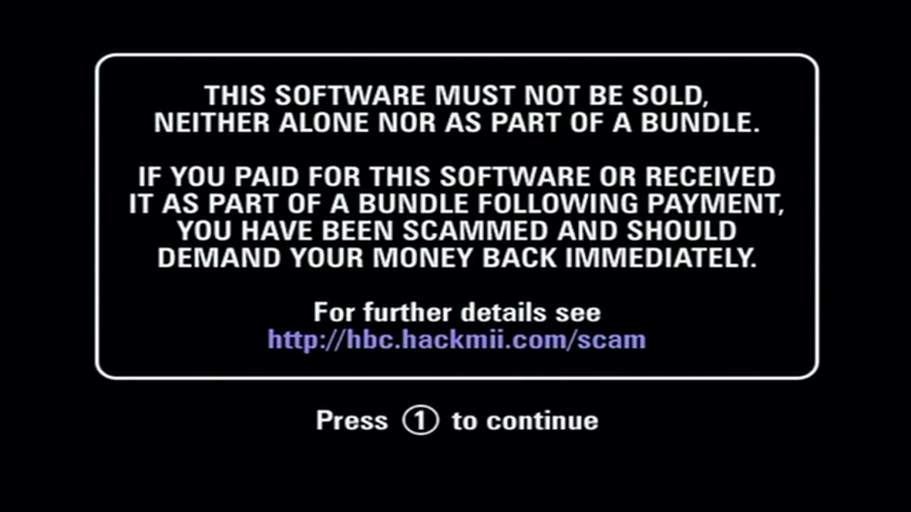
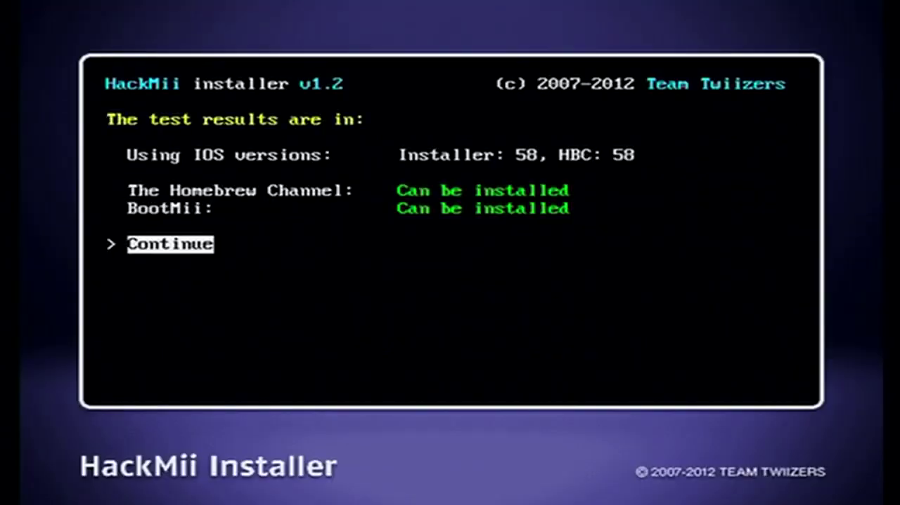
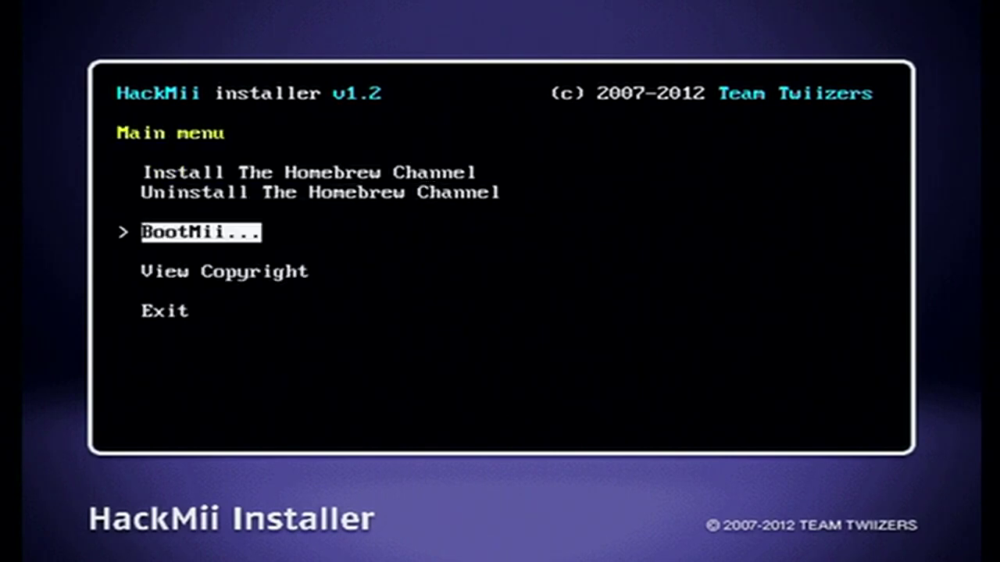
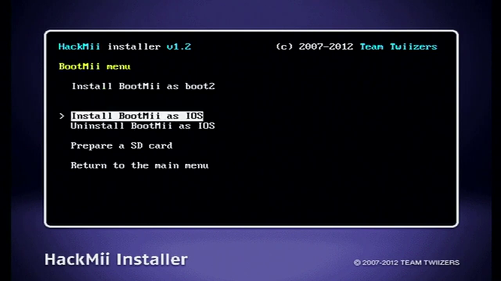
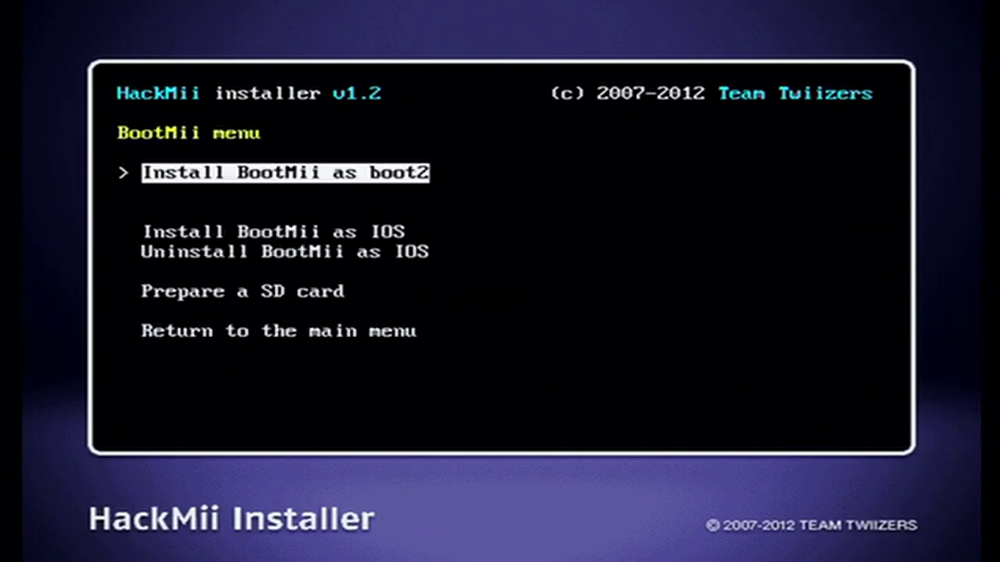

# Installing the Homebrew Channel and BootMii

?> For support in English, ask in the discord [server](https://discord.gg/dK5rNaMhMt)

The Homebrew Channel allows you to launch Homebrew applications and BootMii helps provide brick protection.

## Installing the Homebrew Channel

1. Upon starting the installation process, you will encounter a warning screen regarding scams. Wait for 30 seconds until a text message appears on the screen that says `Press 1 to continue` Once you see this message, press the `1` button on your controller.

2. This will take you to the HackMii installer. Locate the `Continue` button on the bottom left of the screen and press it.

3. In the HackMii installer menu, select the option that says `Install the Homebrew Channel`

4. Wait for the installation to complete, and once finished, press the `Continue` button to proceed.

## Installing BootMii

!> If you are hacking the Wii Mini, you can skip the next steps. Instead, exit the HackMii installer and proceed with the installation of [Priiloader](/priiloader).
 
1. Press the `Back` button to return to the previous menu, and then select `BootMii`.

2. Choose the option to install BootMii as an IOS. If prompted, also install it as boot2 if available for your Wii model.

?> To use BootMii, you will need an SD card

3. After the installation of BootMii is completed, select "Continue." Then, choose the option to "Exit." This will take you back to the Homebrew Channel.

## Done!

You've now installed the Homebrew Channel. You can use this to launch Homebrew apps!

- [Continue to creating a NAND backup](nandbackup)
