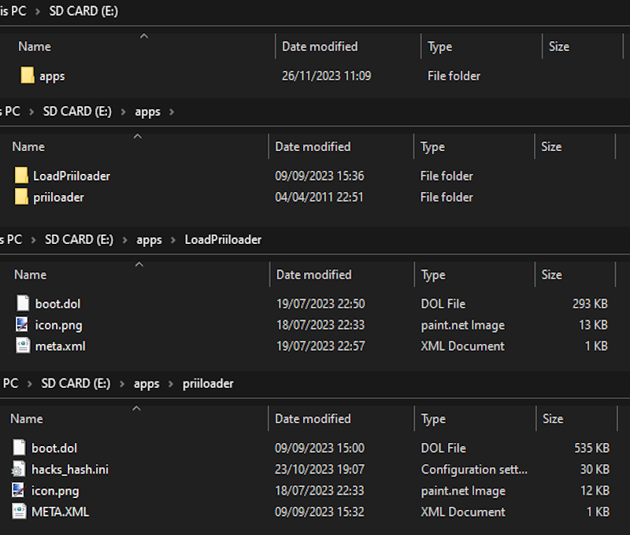
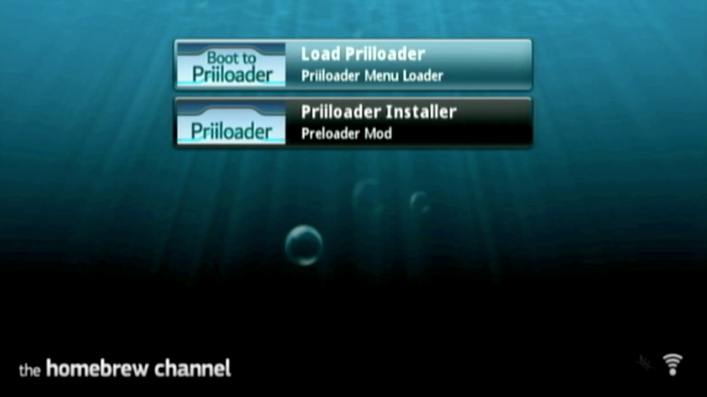
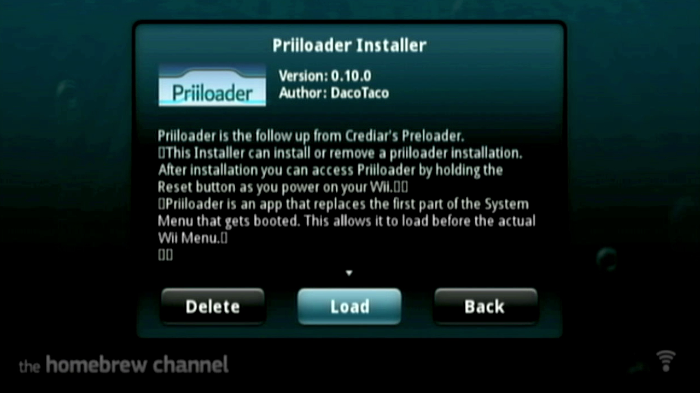
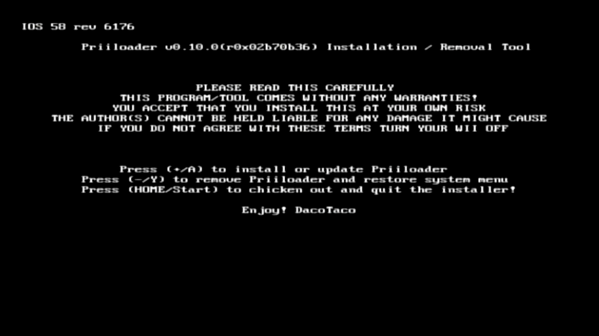
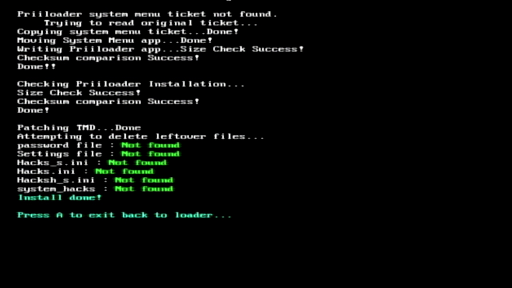
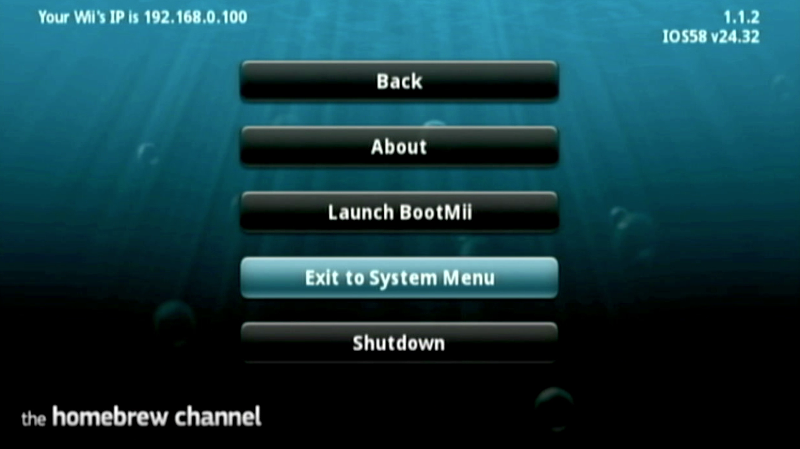

# Installing Priiloader

Priiloader gives your Wii brick protection. You can also use it to do many useful things like automatically patching your games to Wiimmfi.

## What do I need?

* An SD card or USB drive
* A PC
* A hacked Wii
* [Priiloader Installer](https://hbb1.oscwii.org/hbb/priiloader/priiloader.zip)
* [Load Priiloader](https://oscwii.org/library/app/loadpriiloader)

?> If you are on Wii U, then you should get the [Priiloader Wii U Forwarder](https://github.com/DacoTaco/priiloader/releases/download/0.10.0/PriiloaderWiiUForwarder.zip) so you can more easily access Priiloader, and be able to access it in case you brick, this also requires [Aroma.](https://wiiu.hacks.guide/#/aroma/getting-started)
## Installation
1. Download [Priiloader Installer](https://hbb1.oscwii.org/hbb/priiloader/priiloader.zip) and [Load Priiloader](https://oscwii.org/library/app/loadpriiloader)
2. Copy the ```apps``` folder from the ```.zip``` you downloaded, and copy it onto the root of your SD card.

3. Insert the SD card into your Wii, then open the Homebrew Channel and launch Priiloader Installer from the list of homebrew


4. Press the `+` button on the Wiimote.


5. Once it has been installed, press A to return to the Homebrew Channel
6. Press the HOME button on the Wii Remote, then select Exit to System Menu to boot into priiloader for the first time.


## Configuring
1. You should now be in Priiloader, if you want to access Priiloader again in the future, you can:
* Wii Only: Hold the (RESET) button while powering it on
* Wii, vWii, Wii Mini: Hold the ```ESC``` key on a connected USB Keyboard while powering it on, or run the Load Priiloader app from the list of homebrew in the Homebrew Channel
* vWii Only: Run the Priiloader Wii U Forwarder
2. Inside Priiloader, Press (A) on ``System Menu Hacks``, then turn on all of the following
    - `Region Free EVERYTHING`
    - `Block disc updates`
    - `Block online updates`

?> If you are on Wii U, you don't need to enable the update-blocking options in Priiloader

3. Scroll down to `save settings` and click `A` then press `B` to return to the Priiloaders main menu

?> To install cIOS, follow [this guide](/cIOS)