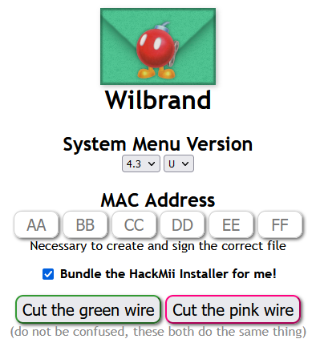

# Wilbrand

!> Please note that modding your Wii does not come with a warranty, and we cannot be held responsible for any damage that may occur to your Wii during the process.

# Running the Exploit

#### Requirements
- An SD card that is formatted to FAT32
- A Wii, on system version 3.0 or above

!> If your SD card is larger than 32GB, you will require third-party software like [GUIformat](http://ridgecrop.co.uk/guiformat.exe) to format it to FAT32.

1. Access the Wii settings. Look for the system menu version and region in the top right corner.
2. Choose `Internet` and then select `Console Information`.
3. Write down your mac address, you'll need it for the next step.

?> Do not share your mac address with anyone. Only the website to launch the exploit.

3. Open a web browser on your PC and go to the [Wilbrand Website](https://wilbrand.donut.eu.org/). Select the appropriate system menu region for your Wii.

4. Once you've inputted your system menu version and region, enter your Wii's MAC address.
5. Tick the box that says `Bundle the HackMii Installer for me!`. Then, cut either wire.
6. Extract the downloaded file's contents on your PC, and then connect your SD card (formatted to FAT32) to your computer.
7. Copy the `Private` folder and the `boot.elf` file from the extracted files. You can disregard any other files.

?> If you already have a `Private` folder on your SD card, it probably contains your existing save file backups. In this case, it's recommended to back it up to a computer temporarily.

8. Safely eject the SD card from your PC and insert it into the Wii. Keep in mind that you should expect to see a green envelope with a pink bomb a few days before, on the same day, or a few days after this step. When it appears, click on it to boot into the Hackmii Installer.

    - [Continue to installing BootMii and the Homebrew Channel](hackmii-installer)
